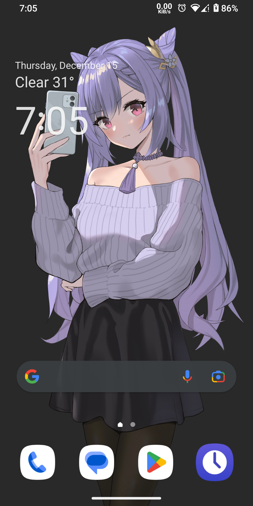
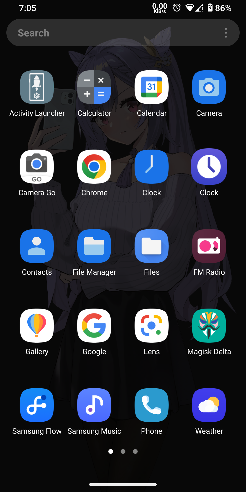
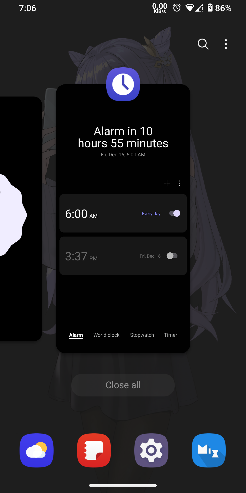
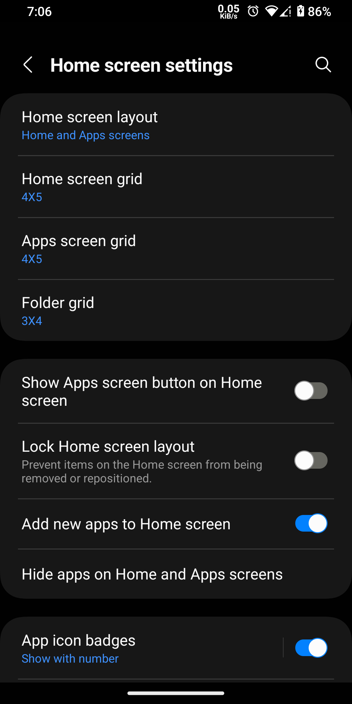
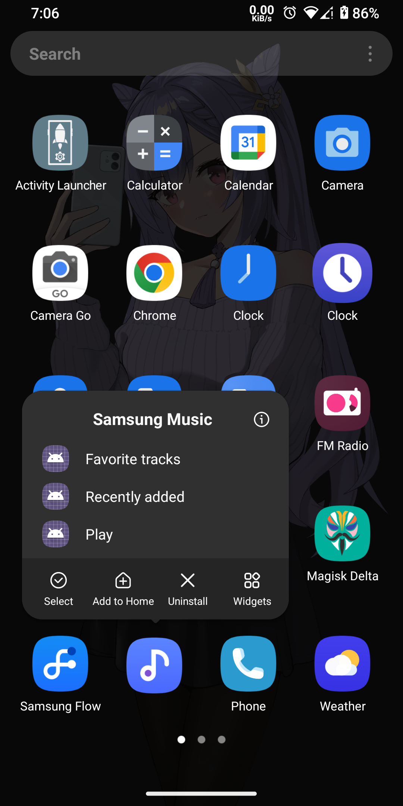

# SamsungLauncherPort
Ported Samsung Launcher for any compatible ROMs

## Screenshot

## Requirements
- Android 13
- Magisk installed

## Download
- You can [download latest release here](https://www.pling.com/p/1541574)

## Installation Guide
- [Download launcher module](https://github.com/AyraHikari/SamsungLauncherPort/blob/main/update.md)
- Open magisk manager, install from zip, select oneui launcher
- Reboot
- Go to settings, apps, default apps, change launcher to OneUI Launcher
- Enjoy

## Known Bugs
- Stack widget not work, remove screen layout if you creating one

## Donations
My Ports project always free, but you can show me your support by making donations
- https://ko-fi.com/ayrahikari
- https://www.paypal.me/AyraHikari
